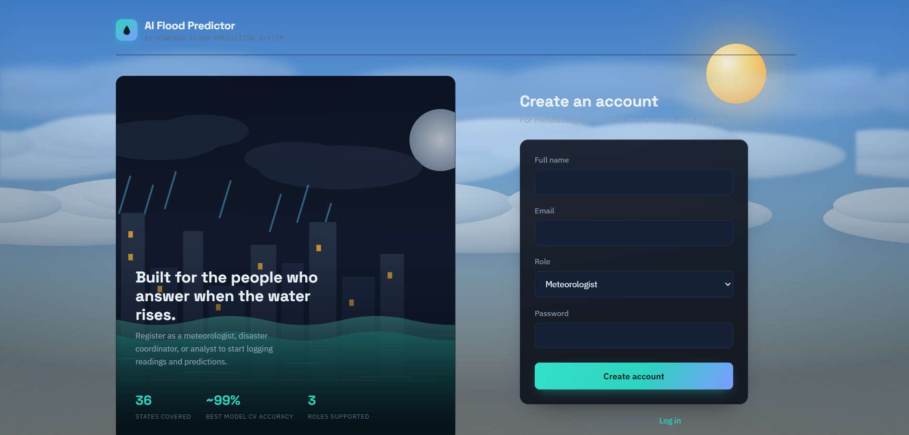
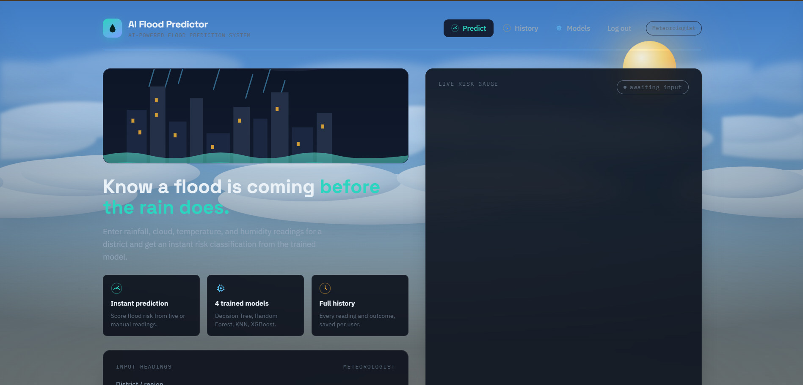
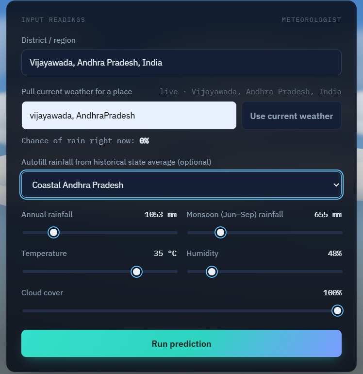
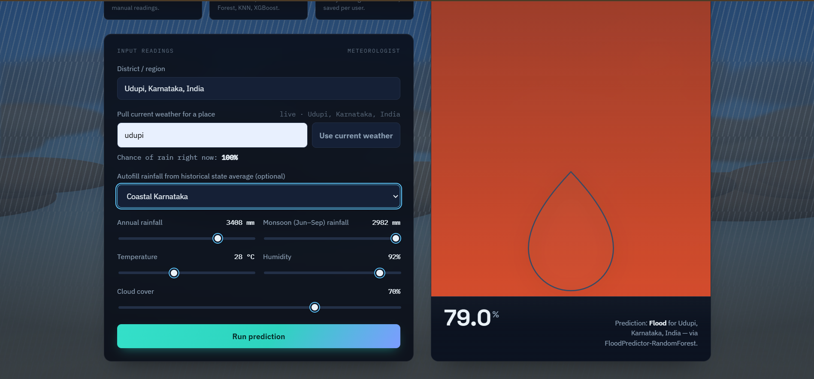
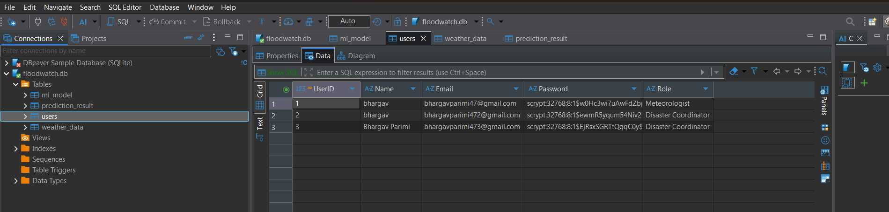
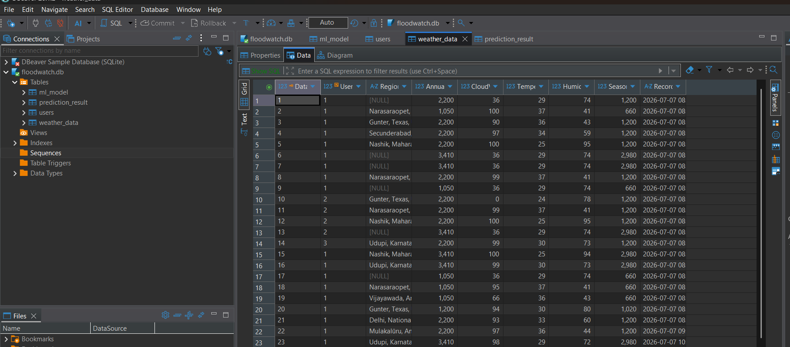

# 🌊 AI-Powered Flood Prediction System

> **An AI-powered web application that predicts flood risk using Machine Learning, historical rainfall data, and live weather information.**


---

# 📖 Project Overview

The **AI-Powered Flood Prediction System** is a Flask-based web application that predicts the probability of floods using Machine Learning models, historical rainfall data, and live weather information.

The system provides an intuitive web interface that allows users to:

- 🔐 Register and Login securely
- 🌍 Fetch live weather data
- 🌧️ Predict flood probability
- 📜 View prediction history
- 🤖 Compare multiple Machine Learning models
- 💾 Store prediction records in a database

The project follows the database architecture:

**Users → Weather_Data → Prediction_Result ← ML_Model**

---

# ✨ Features

- 🔐 User Authentication (Login & Registration)
- 🌍 Live Weather Integration (Open-Meteo API)
- 🌧️ AI-Based Flood Prediction
- 📊 Interactive Dashboard
- 📈 Flood Probability Estimation
- 📜 Prediction History
- 🤖 Multiple Machine Learning Models
- 💾 SQLite Database
- 🎨 Responsive User Interface

---

# 🛠️ Technology Stack

### Frontend
- HTML5
- CSS3
- JavaScript

### Backend
- Python
- Flask

### Machine Learning
- Scikit-Learn
- Random Forest
- Decision Tree
- K-Nearest Neighbors (KNN)
- XGBoost

### Database
- SQLite

---

# 📂 Project Structure

```text
AI-Powered-Flood-Prediction-System/
│
├── app.py
├── models.py
├── requirements.txt
├── README.md
│
├── ml/
│   ├── train_model.py
│   ├── best_model.pkl
│   ├── decision_tree.pkl
│   ├── knn.pkl
│   ├── xgboost.pkl
│   ├── model_meta.json
│   └── state_rainfall.json
│
├── static/
├── templates/
├── screenshots/
└── instance/
```

---

# 📸 Application Screenshots

<table>
<tr>
<td align="center">
<b>Login Page</b><br>

</td>

<td align="center">
<b>Registration Page</b><br>

</td>
</tr>

<tr>
<td align="center">
<b>Prediction Dashboard</b><br>

</td>

<td align="center">
<b>Flood Prediction Result</b><br>

</td>
</tr>

<tr>
<td align="center">
<b>Prediction History</b><br>

</td>

<td align="center">
<b>Prediction Result</b><br>

</td>
</tr>

<tr>
<td align="center">
<b>Users Table</b><br>

</td>

<td align="center">
<b>Weather Data Table</b><br>

</td>
</tr>
</table>

---

# 🚀 Installation

### Clone the repository

```bash
git clone https://github.com/AP24110010419/AI-Powered-Flood-Prediction-System.git
```

### Navigate to the project folder

```bash
cd AI-Powered-Flood-Prediction-System
```

### Install dependencies

```bash
pip install -r requirements.txt
```

### Run the application

```bash
python app.py
```

### Open the application

```
http://127.0.0.1:5000
```

---

# 🌍 Live Weather Integration

The application uses the **Open-Meteo API** to fetch:

- 🌡 Temperature
- 💧 Humidity
- ☁ Cloud Cover

Users can enter a location (for example, **Kochi, Kerala**) to retrieve current weather information before running the flood prediction.

---

# 🤖 Machine Learning Models

The application evaluates multiple Machine Learning algorithms.

| Model | Purpose |
|--------|---------|
| Decision Tree | Classification |
| Random Forest | Active Prediction Model |
| K-Nearest Neighbors (KNN) | Classification |
| XGBoost | High Accuracy Prediction |

The model with the best performance is automatically selected for live predictions.

---

# 📊 Datasets

This project uses:

- Flood Prediction Dataset
- Rainfall in India (1901–2015)

Prediction is based on the following features:

- Annual Rainfall
- Monsoon Rainfall
- Temperature
- Humidity
- Cloud Cover

---

# 🗄️ Database Schema

The system contains four primary tables:

- Users
- Weather_Data
- Prediction_Result
- ML_Model

These tables store user accounts, weather readings, trained models, and prediction history.

---

# 🔄 Project Workflow

```text
User Login/Register
        │
        ▼
Enter Location
        │
        ▼
Fetch Live Weather
        │
        ▼
Historical Rainfall Data
        │
        ▼
Feature Processing
        │
        ▼
Machine Learning Model
        │
        ▼
Flood Prediction
        │
        ▼
Store Result in Database
        │
        ▼
Prediction History
```

---

# 🎯 Future Enhancements

- 📱 Mobile Application
- ☁️ Cloud Deployment
- 📍 Interactive Flood Risk Maps
- 📧 Email Notifications
- 📊 Advanced Analytics Dashboard
- 🌦 Weather Forecast Integration

---

# 👨‍💻 Author

**Bhargav Parimi**

**B.Tech – Computer Science Engineering**

**SRM University AP**

📧 Email: **bhargavparimi47@gmail.com**

🔗 GitHub: **https://github.com/AP24110010419**

---

# ⭐ Support

If you found this project useful, please consider giving it a ⭐ on GitHub.

---

<div align="center">

## 🌊 AI-Powered Flood Prediction System

**Built with ❤️ using Python, Flask, and Machine Learning**

</div>